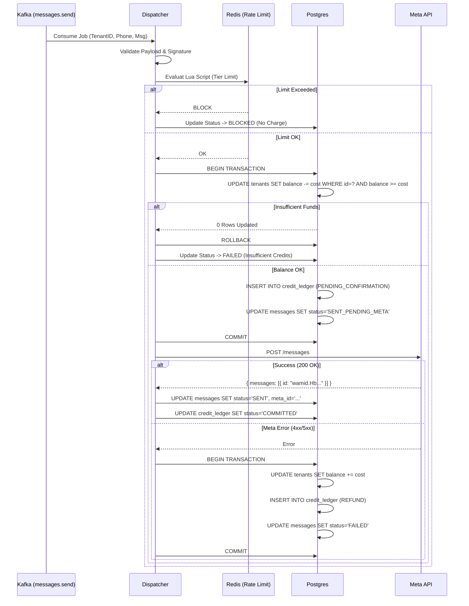
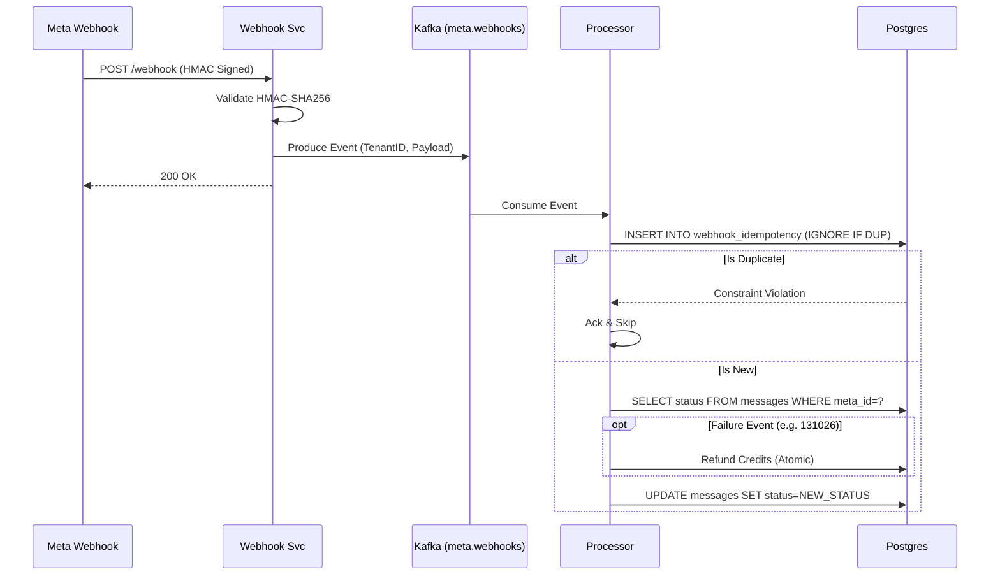

# Meta WhatsApp Business Cloud API Integration Design (High-Scale)

**Version**: 2.0  
**Target Scale**: 10,000+ Tenants | 5M+ Daily Messages  
**Infrastructure**: Node.js, PostgreSQL, Redis Cluster, Kafka, EKS, AES-256

---

## 1. Architecture Overview

This architecture ensures strict tenant isolation, financial integrity (ledger safety), and high throughput using an event-driven model.

```mermaid
graph TD
    %% Clients
    TenantAdmin[Tenant Admin] -->|HTTPS| API_Gateway[API Gateway]
    
    %% Core Services
    subgraph "Core Services (EKS)"
        API_Svc[API Service]
        Scheduler[Scheduler Service]
        Dispatcher[Dispatcher Worker (Group)]
        Webhook_Svc[Webhook Receiver]
        Processor[Webhook Processor (Group)]
        Reconciler[Reconciliation Job]
    end
    
    %% Data & Pub/Sub
    subgraph "Persistence layer"
        DB[(PostgreSQL\nShared Schema\nRow-Level Security)]
        Redis[(Redis Cluster\nRate Limit & Cache)]
        Kafka{Kafka Cluster}
        Secrets[(AWS Secrets Manager)]
    end
    
    %% External
    subgraph "External"
        Meta[Meta WhatsApp Cloud API]
    end

    %% Flows
    API_Svc -->|Produce: send_job| Kafka
    Scheduler -->|Produce: scheduled_job| Kafka
    Kafka -->|Topic: messages.send| Dispatcher
    
    Dispatcher -->|Check Tier| Redis
    Dispatcher -->|Atomic Debit| DB
    Dispatcher -->|Decrypt Token| Secrets
    Dispatcher -->|POST| Meta
    
    Meta -->|POST Webhook| Webhook_Svc
    Webhook_Svc -->|Produce: webhook_event| Kafka
    Kafka -->|Topic: meta.webhooks| Processor
    
    Processor -->|Idempotency Check| DB
    Processor -->|Update Status/Refund| DB
    
    Reconciler -->|Poll Unknowns| DB
    Reconciler -->|Verify Status| Meta
```

---

## 2. Database Design (Financial & Idempotency)

### 2.1 Tables

**`whatsapp_accounts`**
```sql
CREATE TABLE whatsapp_accounts (
    id UUID PRIMARY KEY DEFAULT gen_random_uuid(),
    tenant_id UUID NOT NULL REFERENCES tenants(id),
    waba_id VARCHAR(50) NOT NULL,
    phone_number_id VARCHAR(50) NOT NULL UNIQUE,
    business_account_id VARCHAR(50) NOT NULL,
    access_token_enc TEXT NOT NULL, -- AES-256-GCM Encrypted
    token_iv VARCHAR(32) NOT NULL, -- Initialization Vector
    token_expires_at TIMESTAMPTZ NOT NULL,
    messaging_tier VARCHAR(20) DEFAULT 'TIER_1K', -- RAW, TIER_1K, TIER_10K...
    quality_rating VARCHAR(10) DEFAULT 'GREEN', -- GREEN, YELLOW, RED
    tier_last_updated TIMESTAMPTZ DEFAULT NOW(),
    is_active BOOLEAN DEFAULT TRUE,
    created_at TIMESTAMPTZ DEFAULT NOW(),
    updated_at TIMESTAMPTZ DEFAULT NOW()
);
CREATE INDEX idx_wa_tenant ON whatsapp_accounts(tenant_id);
```

**`messages` (State Machine)**
```sql
CREATE TYPE message_status AS ENUM (
    'PENDING', 'QUEUED', 'SENT_PENDING_META', 
    'SENT', 'DELIVERED', 'READ', 'FAILED', 'BLOCKED'
);

CREATE TABLE messages (
    id UUID PRIMARY KEY DEFAULT gen_random_uuid(),
    tenant_id UUID NOT NULL,
    job_id UUID UNIQUE NOT NULL, -- Idempotency key for dispatch
    wa_account_id UUID REFERENCES whatsapp_accounts(id),
    meta_message_id VARCHAR(100), -- WAMID
    recipient_phone VARCHAR(20) NOT NULL,
    status message_status DEFAULT 'PENDING',
    cost DECIMAL(10, 4) DEFAULT 0,
    error_code VARCHAR(20),
    error_desc TEXT,
    created_at TIMESTAMPTZ DEFAULT NOW(),
    updated_at TIMESTAMPTZ DEFAULT NOW()
);
CREATE INDEX idx_msg_meta_id ON messages(meta_message_id); -- Critical for webhook lookup
CREATE INDEX idx_msg_status_pending ON messages(status) WHERE status = 'SENT_PENDING_META'; -- For Reconciliation
```

**`credit_ledger` (Atomic Log)**
```sql
CREATE TABLE credit_ledger (
    id UUID PRIMARY KEY DEFAULT gen_random_uuid(),
    tenant_id UUID NOT NULL,
    reference_id UUID NOT NULL, -- Message ID or System Ref
    amount DECIMAL(10, 4) NOT NULL, -- Negative for debit, Positive for credit
    type VARCHAR(20) NOT NULL, -- 'MESSAGE_SEND', 'REFUND', 'TOPUP'
    status VARCHAR(20) DEFAULT 'COMMITTED', -- 'PENDING_CONFIRMATION', 'COMMITTED', 'ROLLED_BACK'
    created_at TIMESTAMPTZ DEFAULT NOW()
);
```

**`webhook_idempotency`**
```sql
CREATE TABLE webhook_idempotency (
    event_id VARCHAR(100) NOT NULL,
    tenant_id UUID NOT NULL,
    processed_at TIMESTAMPTZ DEFAULT NOW(),
    PRIMARY KEY (tenant_id, event_id) -- Composite PK ensures tenant isolation
);
```

### 2.2 Tenants Table Update (For Locking)
```sql
ALTER TABLE tenants ADD COLUMN credit_balance DECIMAL(15, 4) DEFAULT 0 CHECK (credit_balance >= 0);
```

---

## 3. Sequence Diagrams

### 3.1 Message Send Flow (Dispatcher)


### 3.2 Webhook Flow (Processor)


---

## 4. Rate Limiting (Redis Lua)

Atomic check-and-increment to prevent race conditions in tier enforcement.

```lua
-- KEYS[1]: tenant:{id}:tier:{phone_id}:rolling24h
-- ARGV[1]: max_limit (from DB/Cache)
-- ARGV[2]: current_timestamp
-- ARGV[3]: window_size (86400)

local key = KEYS[1]
local limit = tonumber(ARGV[1])
local now = tonumber(ARGV[2])
local window = tonumber(ARGV[3])

-- Clean up old entries
redis.call('ZREMRANGEBYSCORE', key, '-inf', now - window)

-- Count current usage
local current_usage = redis.call('ZCARD', key)

if current_usage < limit then
    -- Add current message
    redis.call('ZADD', key, now, now)
    redis.call('EXPIRE', key, window) -- Refresh TTL
    return 1 -- OK
else
    return 0 -- BLOCKED
end
```

---

## 5. Circuit Breaker Strategy

To protect against generic Meta outages (e.g., 500 errors).

| State | Condition | Action |
| :--- | :--- | :--- |
| **CLOSED** | < 50% Failures (30s window) | Requests flow normally. |
| **OPEN** | > 50% Failures detected | Reject requests immediately. Throw `CircuitBreakerOpenException`. |
| **HALF_OPEN** | 60s cooldown passed | Allow 1 trial request. If success -> CLOSED. If fail -> OPEN. |

**Implementation**:
Use `opossum` or custom middleware wrapping the axios client.  
**Persistence**: State shared via Redis (`circuit:{phone_id}`) to sync across worker nodes.

---

## 6. Token Management & Security

### 6.1 Encryption
All tokens stored using **AES-256-GCM**.
*   **Key**: Retrieved from AWS Secrets Manager at runtime (never stored in DB).
*   **IV**: Random 16 bytes generated per token, stored in DB `token_iv`.
*   **Auth Tag**: Appended to ciphertext for integrity check.

### 6.2 Rotation & Expiry
*   **Cron Job**: Runs every hour. Checks `token_expires_at < NOW() + 72h`.
*   **Action**:
    *   If < 72h: Trigger alert/email to Tenant Admin.
    *   If < 1h: Try programmatic refresh (if applicable) or disable account `is_active=false`.

---

## 7. Reconciliation Job

**Frequency**: Every 15 minutes.  
**Target**: Messages in `SENT_PENDING_META` state > 5 minutes.

**Logic**:
1.  Select stale messages.
2.  Batch query Meta Graph API `GET /{phone_id}/messages?ids={job_id}` (using Client Reference ID).
3.  **Scenario A (Found)**:
    *   Meta returns WAMID.
    *   Update DB: `status='SENT'`, `meta_message_id=wamid`.
4.  **Scenario B (Not Found)**:
    *   Message was never accepted by Meta (Networking crash before response).
    *   **Action**: Refund Credits + Mark FAILED.

---

## 8. Failure Classification Table

| Error Code | Type | Action | Refund? | Alert? |
| :--- | :--- | :--- | :--- | :--- |
| `130429` | Rate Limit | Retry (Exp Backoff) | No | No |
| `131042` | Integirty | Mark FAILED. Add to Suppression List. | **Yes** | No |
| `131026` | Template | Mark FAILED. Template Paused. | **Yes** | Yes |
| `131047` | Spam | Mark FAILED. 24h Block. | **Yes** | **Critical** |
| `5xx` | Server | Retry (3x) -> Circuit Breaker | No | Yes |
| `ECONNRESET`| Network | Retry -> Reconciliation | No | No |

---

## 9. Scaling Plan (5M/Day)

*   **Kafka Partitioning**:
    *   Topic: `messages.send`
    *   Partitions: 50+
    *   Key: `hash(tenant_id)` (Ensures strict ordering per tenant).
*   **Consumer Groups**:
    *   `dispatcher-group`: Autoscales based on lag.
*   **Database**:
    *   Use **Partitioning** on `messages` table by `created_at` (Monthly).
    *   Read-heavy queries (Analytics) go to **Read Replicas**.
*   **Redis**:
    *   Cluster mode enabled.
    *   Keys tagged `{tenant_id}` to ensure slot locality.

---

## 10. Webhook Logic (Pseudocode)

```javascript
/* Webhook Processor */
async function processWebhook(payload, signature) {
    // 1. Validate Signature
    if (!isValidSignature(payload, signature)) throw new Error('Invalid Signature');

    // 2. Validate Timestamp (Anti-Replay)
    if (Date.now() - payload.timestamp > 300000) return; // Drop older than 5m

    for (const entry of payload.entry) {
        for (const change of entry.changes) {
            const value = change.value;
            const eventId = value.id; // Meta Event ID
            
            // 3. Idempotency Check (DB Constraint)
            try {
                await DB.insertWebhookEvent(tenantId, eventId);
            } catch (e) {
                if (e.code === 'UNIQUE_VIOLATION') return; // Skip duplicate
                throw e;
            }

            // 4. Process Status
            if (value.statuses) {
                const status = value.statuses[0];
                const metaId = status.id;
                
                // State Guard
                const currentStatus = await DB.getMessageStatus(metaId);
                if (!isValidTransition(currentStatus, status.status)) return;

                // Handle Failure Refund
                if (status.status === 'failed') {
                    const error = status.errors[0];
                    if (isRefundable(error.code)) {
                        await DB.refundCredits(tenantId, metaId);
                    }
                    if (error.code === 131042) { // Invalid Number
                        await DB.suppressNumber(tenantId, status.recipient_id);
                    }
                }

                await DB.updateMessageStatus(metaId, status.status);
            }
        }
    }
}
```

---

## 11. Security Checklist

- [x] **Secret Management**: No hardcoded secrets. Use AWS Secrets Manager.
- [x] **Encryption**: AES-256-GCM for tokens.
- [x] **Isolation**: Every query includes `WHERE tenant_id = ?`.
- [x] **PII**: Phone numbers masked in logs (`+1 555-***-1234`).
- [x] **Least Privilege**: DB User for Dispatcher cannot DROP tables.
- [x] **Egress Control**: NAT Gateway for outbound Meta traffic only.

---

## 12. Final Guarantees

1.  **No Negative Balance**: Enforced by Database `CHECK (balance >= 0)` constraint and Atomic `UPDATE ... WHERE balance >= cost`.
2.  **No Double Debit**: Transactional coupling of Debit + Job Status Update.
3.  **No Double Refund**: Refund logic checks `credit_ledger` state before executing.
4.  **No Cross-Tenant Leak**: Composite keys in Redis and strict SQL `WHERE` clauses.
5.  **Fault Tolerance**: Kafka redelivery + Dead Letter Queue (DLQ) + Reconciliation Job.
